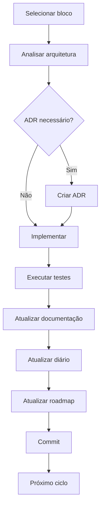

# Fluxo de Desenvolvimento

## 1. Objetivo

Este documento define o fluxo oficial de desenvolvimento do projeto Pager.

Seu objetivo é garantir que todas as implementações sigam um processo consistente, rastreável e incremental, preservando a qualidade do código e da documentação ao longo da evolução do sistema.

---

## 2. Princípios do Processo

- desenvolvimento incremental;
- documentação como parte da implementação;
- decisões arquiteturais registradas;
- rastreabilidade;
- revisão antes de avançar.

Esse capítulo define a filosofia do processo, não da arquitetura.

---

## 3. Ciclo Oficial de Desenvolvimento

```
Planejamento

↓

Selecionar o próximo bloco do roadmap

↓

Analisar impacto arquitetural

↓

Criar ADR (quando necessário)

↓

Implementar

↓

Executar testes

↓

Commit

↓

Registrar implementação no diário

↓

Atualizar roadmap

↓

Próximo ciclo
```

Fluxo em diagrama Mermaid.



Esse diagrama resume praticamente toda a metodologia do projeto.

---

## 4. Atualização da Documentação

| Documento | Quando atualizar |
| --- | --- |
| requisitos.md | Mudança no domínio |
| arquitetura.md | Mudança estrutural |
| roadmap.md | Início ou conclusão de bloco |
| diario.md | Ao final de cada implementação |
| workflow.md | Mudança no processo |
| ADR | Nova decisão arquitetural relevante |

Essa tabela sozinha evita muitas dúvidas futuras.

---

## 5. Critérios para criação de ADR

Criar ADR quando houver:

- mudança arquitetural;
- nova tecnologia;
- alteração de padrão;
- decisão difícil de reverter.

Não criar ADR para:

- correções de bugs;
- novas telas;
- pequenas refatorações;
- ajustes visuais.

Isso evita gerar ADRs desnecessários.

---

## 6. Estratégia de Implementação

Cada implementação deve:

- possuir objetivo claro;
- possuir escopo limitado;
- preservar estabilidade do projeto;
- concluir uma unidade lógica de trabalho.

Isso evita implementar "metade" de um módulo.

---

## 7. Fluxo de Versionamento

```
Implementação

↓

Testes

↓

Commit

↓

Atualização da documentação

↓

Próxima implementação
```

Quando um bloco terminar:
```
Tag

↓

Novo bloco
```

Acho interessante explicitar que a documentação faz parte da entrega do bloco, não uma atividade opcional.

---

## 8. Critérios de Conclusão de um Bloco

Um bloco somente poderá ser considerado concluído quando:

- todas as funcionalidades previstas forem implementadas;
- testes executados;
- documentação atualizada;
- diário atualizado;
- roadmap atualizado;
- eventuais ADRs registrados.

Isso complementa o roadmap.md.

---

## 9. Melhoria Contínua

O workflow definido neste documento poderá ser revisado sempre que forem identificadas oportunidades de melhoria no processo de desenvolvimento.

Alterações significativas deverão ser registradas neste documento antes de sua adoção.
