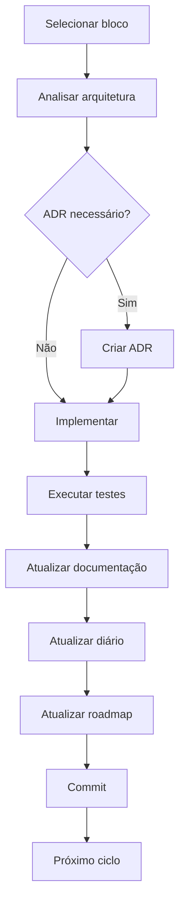

# Fluxo de Desenvolvimento

## 1. Objetivo

Este documento define o fluxo oficial de desenvolvimento do projeto Pager.

Seu objetivo é garantir que todas as implementações sigam um processo consistente, rastreável e incremental, preservando a qualidade do código e da documentação ao longo da evolução do sistema.

---

## 2. Princípios do Processo

- desenvolvimento incremental;
- documentação como parte da implementação;
- decisões arquiteturais registradas;
- rastreabilidade;
- revisão antes de avançar.

Esse capítulo define a filosofia do processo, não da arquitetura.

---

## 3. Ciclo Oficial de Desenvolvimento

```
Planejamento

↓

Selecionar o próximo bloco do roadmap

↓

Analisar impacto arquitetural

↓

Criar ADR (quando necessário)

↓

Implementar

↓

Executar testes

↓

Commit

↓

Registrar implementação no diário

↓

Atualizar roadmap

↓

Próximo ciclo
```

Fluxo em diagrama Mermaid.



Esse diagrama resume praticamente toda a metodologia do projeto.

---

## 4. Atualização da Documentação

| Documento | Quando atualizar |
| --- | --- |
| requisitos.md | Mudança no domínio |
| arquitetura.md | Mudança estrutural |
| roadmap.md | Início ou conclusão de bloco |
| diario.md | Ao final de cada implementação |
| workflow.md | Mudança no processo |
| ADR | Nova decisão arquitetural relevante |

Essa tabela sozinha evita muitas dúvidas futuras.

---

## 5. Critérios para criação de ADR

Criar ADR quando houver:

- mudança arquitetural;
- nova tecnologia;
- alteração de padrão;
- decisão difícil de reverter.

Não criar ADR para:

- correções de bugs;
- novas telas;
- pequenas refatorações;
- ajustes visuais.

Isso evita gerar ADRs desnecessários.

---

## 6. Estratégia de Implementação

Cada implementação deve:

- possuir objetivo claro;
- possuir escopo limitado;
- preservar estabilidade do projeto;
- concluir uma unidade lógica de trabalho.

Isso evita implementar "metade" de um módulo.

---

## 7. Fluxo de Versionamento

```
Implementação

↓

Testes

↓

Commit

↓

Atualização da documentação

↓

Próxima implementação
```

Quando um bloco terminar:
```
Tag

↓

Novo bloco
```

Acho interessante explicitar que a documentação faz parte da entrega do bloco, não uma atividade opcional.

---

## 8. Critérios de Conclusão de um Bloco

Um bloco somente poderá ser considerado concluído quando:

- todas as funcionalidades previstas forem implementadas;
- testes executados;
- documentação atualizada;
- diário atualizado;
- roadmap atualizado;
- eventuais ADRs registrados.

Isso complementa o roadmap.md.

---

## 9. Melhoria Contínua

O workflow definido neste documento poderá ser revisado sempre que forem identificadas oportunidades de melhoria no processo de desenvolvimento.

Alterações significativas deverão ser registradas neste documento antes de sua adoção.

---

## 2026-08-19

### Bloco 1 — Autenticação e Autorização

#### BL-01.1 — Modelagem de identidade e persistência

##### Objetivo

Preparar o modelo persistente necessário para autenticação e autorização.

##### Implementações

- definição dos papéis `STAFF`, `MANAGER` e `ADMIN`;
- definição do modelo `User`;
- criação dos campos relacionados à identidade, credenciais e estado do usuário;
- criação do enum `UserRole`;
- implementação do `schema.prisma`;
- criação da migration inicial;
- integração do Prisma ao modelo de autenticação.

##### Resultado

O banco de dados passou a possuir a estrutura persistente necessária para usuários e papéis da aplicação.

---

#### BL-01.2 — Estrutura inicial do AuthModule

##### Objetivo

Preparar a estrutura modular responsável pela autenticação.

##### Implementações

- criação do `AuthModule`;
- criação do `AuthService`;
- criação do `LoginDto`;
- criação da estrutura de controllers, DTOs, services e strategies;
- instalação das dependências relacionadas à autenticação;
- configuração do Argon2;
- preparação da integração com JWT.

##### Resultado

O Backend passou a possuir a estrutura modular necessária para implementar o fluxo de autenticação.

---

#### BL-01.3 — Autenticação JWT

##### Objetivo

Implementar e validar o fluxo completo de autenticação baseado em JWT.

##### Implementações

- validação de credenciais utilizando Prisma;
- hash e verificação de senhas utilizando Argon2;
- configuração centralizada do JWT;
- implementação da `JwtStrategy`;
- implementação do `JwtAuthGuard`;
- implementação do endpoint `POST /api/auth/login`;
- implementação do bootstrap do primeiro usuário `ADMIN`;
- implementação de seed idempotente;
- implementação do endpoint protegido `GET /api/auth/me`.

##### Validação

Foram realizados testes de:

- validação do tamanho mínimo da senha no `LoginDto`;
- rejeição de credenciais inválidas;
- criação do usuário `ADMIN`;
- execução idempotente do seed;
- rejeição de acesso à rota protegida sem JWT;
- autenticação válida e emissão de `accessToken`;
- acesso à rota protegida utilizando JWT válido.

##### Resultado

O fluxo de autenticação encontra-se funcional de ponta a ponta:

`credenciais → validação → Prisma → Argon2 → JWT → JwtAuthGuard → JwtStrategy → usuário autenticado`.

##### Observações

Durante a implementação do bootstrap administrativo foi necessário recriar os containers utilizando `docker compose down` seguido de `docker compose up`, para que as novas variáveis de ambiente fossem incorporadas ao container Backend.

O mecanismo de autorização RBAC ainda não foi implementado e permanece como o próximo incremento do Bloco 1.
